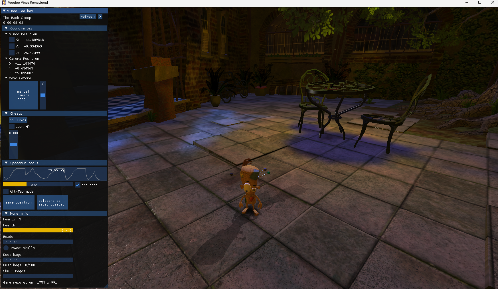

how to use this fine piece of software:

-go to the releases tab and install the zip file 
-extract the .exe file 
-open the game (only steam version tested so far) 
-you might need to add the program to your windows defender exception list 
-click on the downloaded .exe file 
-and then maybe it works 

for the steam version:
For saving your current position and teleporting there, enable steam input, go to community layouts and download "chameleon's toolbox layout".
This will press the F5 key when pressing D-Pad left (saving the current position), and the F6 key when pressing D-Pad right (teleporting to that position)

If you don't want to use steam input or are on a different version, map these buttons using a different program.

